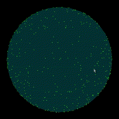

# 3DQ - Interactive 3D Sphere Visualization

A real-time 3D visualization application that renders a semi-transparent sphere with randomly distributed points on its surface. The sphere can be rotated interactively using mouse controls.



## Features

- Semi-transparent sphere rendering
- Random point distribution on sphere surface
- Interactive rotation with mouse controls
- Smooth 3D perspective rendering
- Depth-aware point visualization

## Requirements

- C++ compiler
- GLFW3
- OpenGL
- GLU

## Building

On Linux systems, install the required dependencies:

```bash
sudo apt install libglfw3-dev libgl1-mesa-dev libglu1-mesa-dev